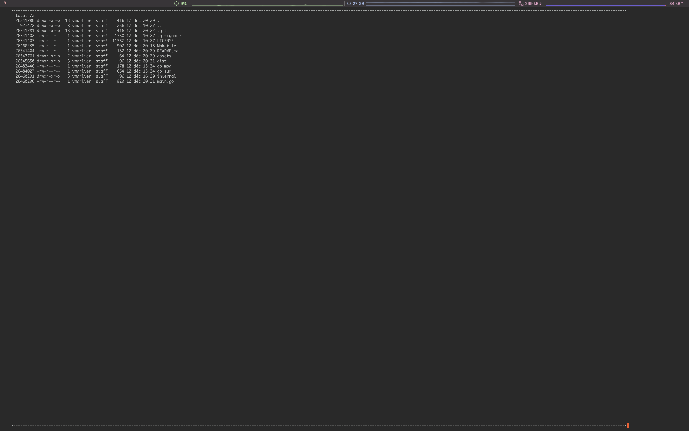
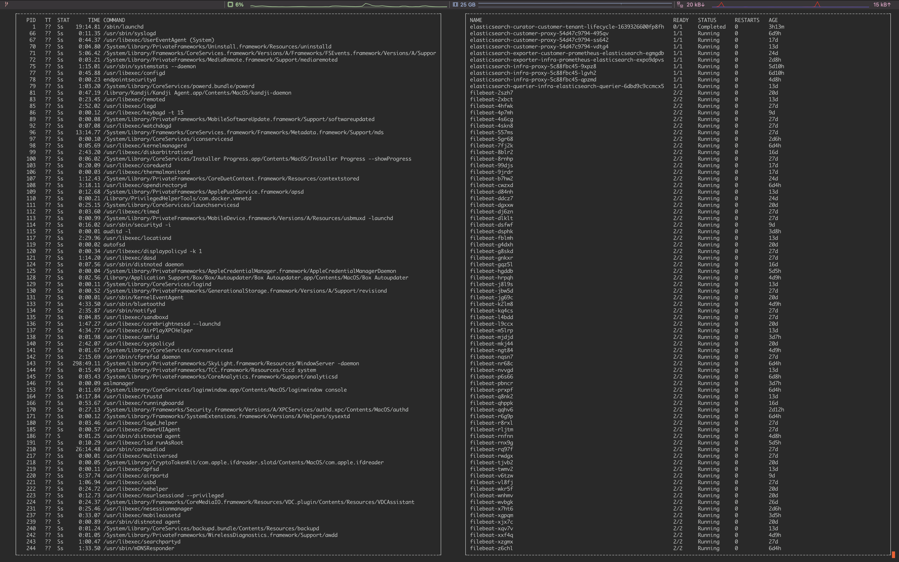

# gwatch (go-watch)
Rewriting of the original `watch` linux command in order to add some new feature to it:
- Better view.
- Execute 2 or 3 commands simultaneously.

## Why ?

I'm working on Kubernetes every single day. And my team and I are using a lot the `watch` tool to monitor of our last change was well applied by Flux for example.
Often I need to opens 2 or 3 tab in my term/tmux to be able to monitor everything. With this tool, we will be able to monitor 2 or 3 things at once.

## What does it look like ?




## How to use it ?

```sh
# basic execution
gwatch "command"

# interval selection (in seconds)
gwatch "command" -i 5

# multiple commands
gwatch -c "command1" -c "command2"
```

## How to install ?

Clone the repository then:
```sh
$ make build
```
